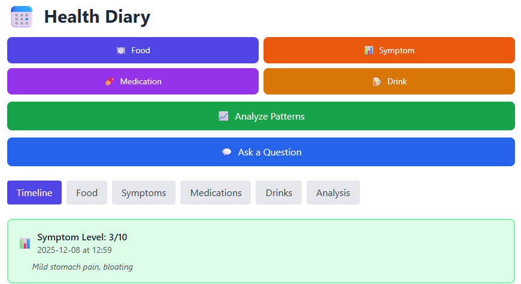

# 📅 Gastro Diary

A personal health tracking application that helps you identify food triggers and patterns affecting your digestive health using AI-powered analysis.

Note: Most of this readme file was also AI generated. I've made a few changes but if you spot anything outrageous please let me know.

## 🎯 What Is This?

Gastro Diary is a web application designed for people suffering from digestive issues (IBS, food intolerances, stomach pain) who want to identify which foods are causing their symptoms. 

Unlike simple food diaries, Health Diary uses **AI analysis** (powered by Claude from Anthropic) to spot patterns you might miss, such as:
- Foods that correlate with symptoms appearing 2-6 hours later
- Specific ingredient triggers
- Severity patterns and time-based trends
- Medication or supplement effects

## ✨ Key Features

### 📝 Comprehensive Tracking
- **Food & Meals** - Log what you eat with timestamps and notes
- **Symptoms** - Record symptom severity (1-10 scale) whenever they occur
- **Medications** - Track medications and supplements with dosages
- **Alcoholic Drinks** - Monitor alcohol consumption and amounts

### 🤖 AI-Powered Insights
- **Pattern Analysis** - Automatically identify foods that correlate with symptoms
- **Time Delay Detection** - Spot when symptoms appear hours after eating
- **Ask Questions** - Query your data: "Which foods contain dairy?" or "What did I eat before my worst symptoms?"
- **Personalized Reports** - Get detailed analysis of the last 24 hours, 3 days, week, or month

### 📊 Data Organization
- **Timeline View** - See all entries (food, symptoms, meds, drinks) chronologically
- **Category Views** - Filter by type to focus on specific data
- **Analysis History** - Review past AI insights and track progress
- **Pagination** - Easy browsing with "Load More" for large datasets

### 🔐 Secure & Private
- **GitHub Authentication** - Secure login with your GitHub account
- **Azure Cloud Storage** - Your data stored safely in Azure Table Storage
- **Personal Instance** - Each deployment is completely private to you
- **No Data Sharing** - Your health data never leaves your Azure tenant

## 🚀 Quick Start

### Prerequisites
- Azure account ([create free account](https://azure.microsoft.com/free/))
- GitHub account ([sign up](https://github.com/join))
- Anthropic API key ([get from Anthropic](https://console.anthropic.com/))

### Deploy Your Own Instance

1. **Fork (Don't clone) this repository** to your GitHub account
   - If you clone you can still use it but you won't be able to use the automatic Github Action that gets created when you integrate the staticwebbap with Github.

2. **Get required credentials:**
   - Azure Subscription ID (found in Azure Portal)
   - GitHub Personal Access Token with `repo` scope ([create here](https://github.com/settings/tokens))
   - Anthropic API key ([get here](https://console.anthropic.com/))

3. **Run the deployment script:**
   ```powershell
   .\deploy.ps1 `
     -SubscriptionId "your-azure-subscription-id" `
     -GitHubRepo "yourusername/health-diary" `
     -GitHubToken "ghp_your_github_token" `
     -AnthropicApiKey "sk-ant-your_anthropic_key"
   ```

4. **Enable authentication**:
   - Go to Azure Portal → Your Static Web App → Authentication
   - Add GitHub as identity provider
   - Save

5. **Start tracking!**
   - Visit your app URL (shown after deployment)
   - Log in with GitHub
   - Begin tracking your health journey

📖 **Full deployment guide:** See [DEPLOYMENT.md](./Deploy/deployment.md) for detailed instructions.

## 💡 How To Use

### Daily Tracking
1. **Log meals** as you eat them (timestamp is automatic)
2. **Log symptoms** whenever they occur - even hours later
3. **Add notes** about portion sizes, preparation methods, or how you feel

### Getting Insights
- **Analyze Patterns** button generates AI analysis of your data
- Choose timeframe: 24 hours, 3 days, week, or month
- Claude identifies correlations between foods and symptoms

### Asking Questions
- Click **"Ask a Question"** to query your data
- Examples:
  - "Which of these foods contain gluten?"
  - "What did I eat before my worst symptoms?"
  - "How often did I take ibuprofen this week?"
- Claude answers based on YOUR actual tracked data

## 🎨 Screenshots



## 🏗️ Technology Stack

- **Frontend:** React, Tailwind CSS
- **Backend:** Azure Functions (Node.js)
- **Database:** Azure Table Storage
- **AI:** Anthropic Claude API
- **Hosting:** Azure Static Web Apps
- **Auth:** GitHub OAuth
- **CI/CD:** GitHub Actions (auto-configured)

## 💰 Cost

Running your own instance costs approximately **£0.50/month** on Azure's free tier:
- Azure Static Web App: Free (100 GB bandwidth/month)
- Azure Storage: ~£0.02/month for typical usage
- Azure Functions: Free (1M executions/month)
- Anthropic API: Pay-per-use (~£0.10-0.50/month for moderate usage)

## 🔒 Privacy & Security

- **Your data is yours** - Stored in YOUR Azure account, not shared with anyone
- **Secure authentication** - GitHub OAuth or EntraID*** 
- **No tracking** - No analytics, no telemetry, no third-party services
- **Open source** - Audit the code yourself, no hidden functionality

***Note that you need to Invite yourself to lock it down to just you. Otherwise anyone with an authenticated Github account (Or EntraID if you configured it will have access.)

## 🤝 Contributing

I am not a developer in any sense and I used Claude.ai to generate the vast majority of the code here. Feel free to contribute but be gentle with me.

## 📝 Use Cases

Perfect for people with:
- **IBS (Irritable Bowel Syndrome)** - Track trigger foods
- **Food Intolerances** - Identify problem ingredients
- **GERD/Acid Reflux** - Monitor dietary patterns
- **Celiac Disease** - Ensure gluten-free compliance
- **Lactose Intolerance** - Track dairy consumption
- **General Digestive Issues** - Understand what affects you

## 🛠️ Development

Want to modify the app for your needs?

```bash
# Clone your fork
git clone https://github.com/yourusername/GastroDiary.git
cd GastroDiary

# Install dependencies
npm install
cd api && npm install && cd ..

# Run locally
npm start
# API: cd api && func start

# Build
npm run build
```

See [DEPLOYMENT.md](DEPLOYMENT.md) for full development setup.

## ⚠️ Medical Disclaimer

**This application is for tracking purposes only and is not medical advice.**

- Always consult healthcare professionals for diagnosis and treatment
- AI analysis is based on patterns in your data, not medical expertise
- Do not make medical decisions based solely on this app
- In case of severe symptoms, seek immediate medical attention


## 🙏 Acknowledgments

- **Anthropic** - For Claude AI API (Me here, not AI IMHO, Claude.ai is better at writing code than anything else I've used.)
- **Microsoft Azure** - For Static Web Apps and cloud infrastructure
- **React Community** - For the excellent framework and ecosystem


---

**Made with ❤️ for anyone on a gut health journey**

If this app helps you, consider:
- ⭐ Starring the repository
- 🐛 Reporting bugs or suggesting features
- 🤝 Contributing improvements
- 📢 Sharing with others who might benefit